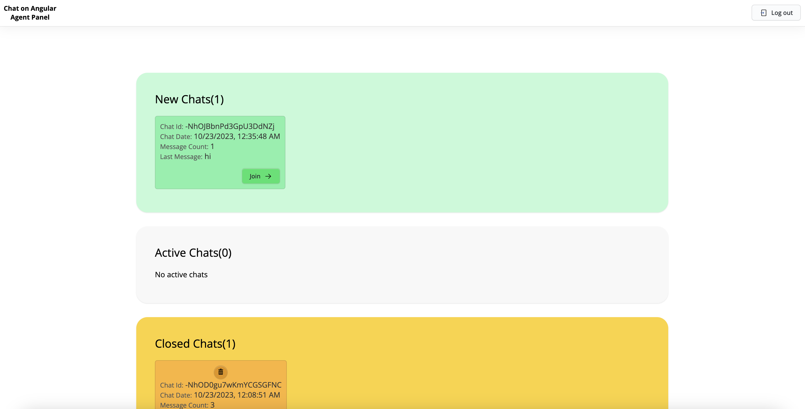

# ChatOnAngular

Instant chap app developed on angular and firebase

### ✨ Built With

 <table>
   <tbody>
      <tr>
        <td align="Center" width="30%"> 
         <a href="https://reactjs.org/" target="_blank" rel="noreferrer">
            
         </a>
            <br>Angular
        </td>
        <td align="Center" width="30%"> 
         <a href="https://reactjs.org/" target="_blank" rel="noreferrer">
            
         </a>
            <br>Firebase
        </td> 
      </tr>
  </tbody>
</table>


### 🖼️ Screenshots




#### Demo

[Customer side - https://mucoban.github.io/chat-on-angular](https://mucoban.github.io/chat-on-angular)

[Agent side - https://mucoban.github.io/chat-on-angular/chat-on-angular/agent](https://mucoban.github.io/chat-on-angular/chat-on-angular?go-to-agent-panel=1)

## Usage
### Firebase
Create a firebase realtime database on https://firebase.google.com
and create a user for customers, and one or more users for agents on [authentication page](https://console.firebase.google.com/u/1/project/chat-on-angular/authentication/users).
Then create agent, customers properties on that database and fill them with user emails that you just created.
```
agents: "agent1@agent1.com,agent2@agent2.com"
customer: "customer@customer.com"
```

### Environment.ts
copy `/src/environments/environment.example.ts` file as `environment.ts`, `environment.prod.ts` 
<br>and fill `environment.firebase` object with your firebase project credentials. 

Fill `environment.customer` value with the email and the password of the account that you created for your customers in your firebase project.

If you want to get an email when a customer starts a chat, fill `environment.formspreeApiUrl` property with your link that you will get from https://formspree.io
```html
export const environment = {
  production: false,
  firebase: {
    apiKey: "",
    authDomain: "",
    databaseURL: "",
    projectId: "",
    storageBucket: "",
    messagingSenderId: "",
    appId: ""
  },
  customer: { email: '', password: '' },
  formspreeApiUrl: '',
};
```

### Deployment
Build your angular project with command `ng build` and upload contents of your `/dist` folder to where you want to serve your chat app.
Use `/agent` route to access agent panel.

To integrate chat app on a page or website, you can have look at `example-page/index.html` file to see the implematation
